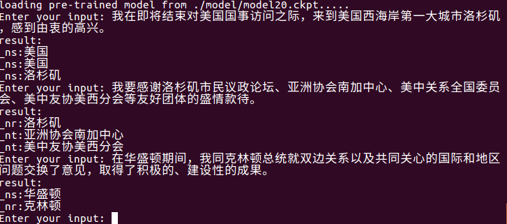
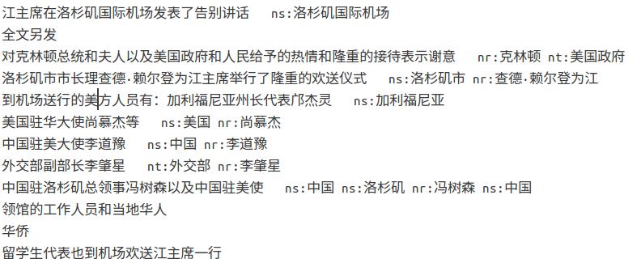

# ChineseNER
模型组成
+ BiLSTM+CRF

本项目使用
+ python 3.6
+ tensorflow 1.7.0

对命名实体识别不了解的可以先看一下<a href="https://blog.csdn.net/buppt/article/details/81180361">这篇文章</a>。

## 数据
data文件夹中有三个开源数据集可供使用，玻森数据 (https://bosonnlp.com) 、1998年人民日报标注数据、MSRA微软亚洲研究院开源数据。其中boson数据集有6种实体类型，人民日报语料和MSRA一般只提取人名、地名、组织名三种实体类型。

先运行数据中的python文件处理数据，供模型使用。

## tensorflow版

### 开始训练
使用 `python train.py` 开始训练，训练的模型会存到model文件夹中。

### 使用预训练的词向量
使用 `python train.py pretrained` 会使用预训练的词向量开始训练，vec.txt是在网上找的一个比较小的预训练词向量，可以参照我的代码修改使用其他更好的预训练词向量。

### 测试训练好的模型
使用 `python train.py test` 进行测试，会自动读取model文件夹中最新的模型，输入中文测试即可，测试结果好坏根据模型的准确度而定。

### 文件级别实体抽取
使用 `python train.py input_file output_file` 进行文件级实体抽取。

可以自动读取model文件夹中最新的模型，将`input_file`中的实体抽取出来写入`output_file`中。先是原句，然后是实体类型及实体（可按照需要修改）。

如 `python train.py test1.txt res.txt` , res.txt内容如下：

> 

## 准确率
参数并没有调的太仔细，boson数据集的f值在70%~75%左右，人民日报和MSRA数据集的f值在85%~90%左右。（毕竟boson有6种实体类型，另外两个只有3种）  
**目前一次实验结果：**  
**Train**  
zhun: 0.9557622032740128  
zhao: 0.9529875285126048  
f: 0.9543728491752699  
**Test**    
zhun: 0.8914285714285715  
zhao: 0.8795339221950761  
f: 0.8854413016743922  
**注：** zhun：准确率， zhao：召回率， f：f1值  

Reference：  
本项目过多的参考了[麻婆豆腐](https://github.com/buppt/ChineseNER)  
**如果觉得我的工作对您有帮助，请不要吝啬右上角的小星星哦！欢迎Fork和Star！也欢迎一起建设这个项目！**     
**留言请在Issues或者email xiezhengwen2013@163.com**
